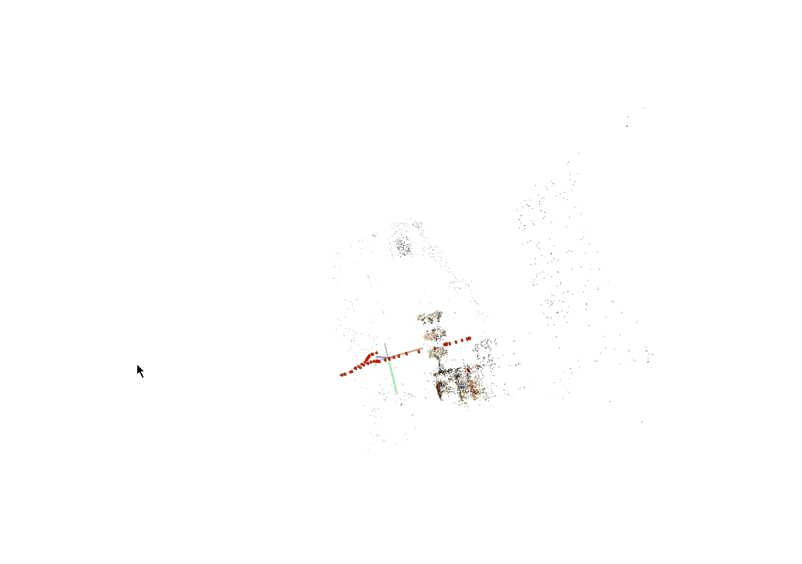
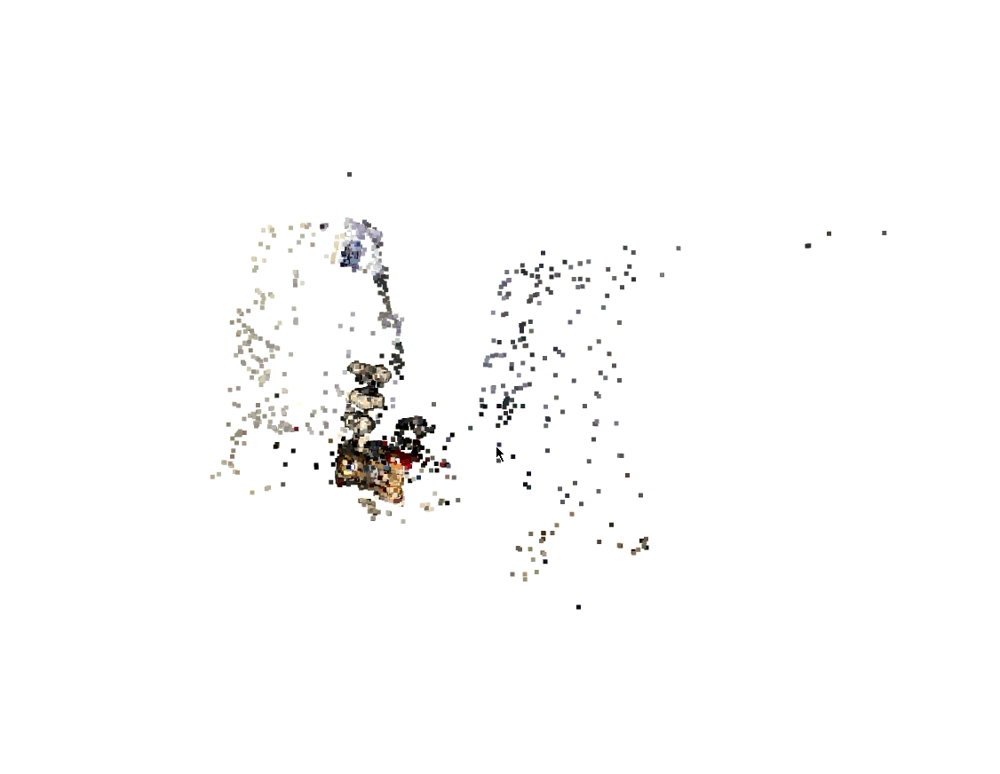
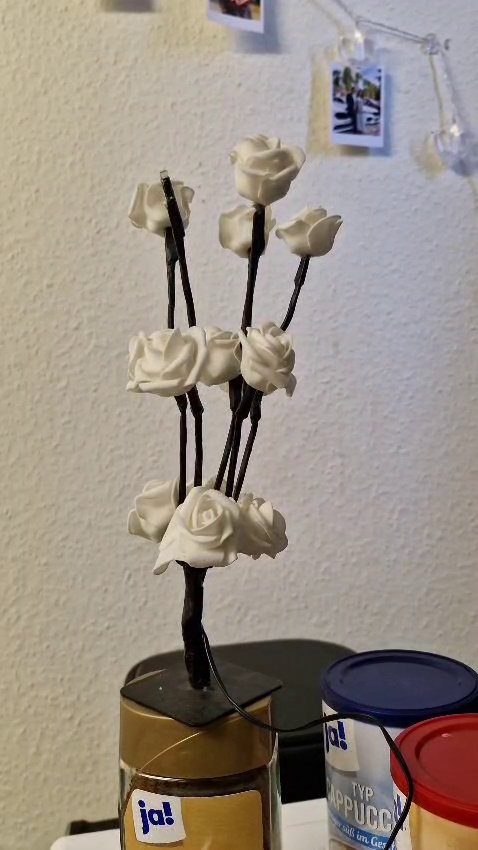

## 📊 System Architecture & Visual Results

<table style="width: 100%; border-collapse: collapse; border: none;">
  <tr style="border: none;">
    <td style="width: 33.33%; text-align: center; border: none; padding: 5px;">
      
      <br/>
      <strong>1. Point Cloud with Camera locations</strong>
    </td>
    <td style="width: 33.33%; text-align: center; border: none; padding: 5px;">
      
      <br/>
      <strong>2. Point Cloud Tracking</strong>
    </td>
    <td style="width: 33.33%; text-align: center; border: none; padding: 5px;">
      
      <br/>
      <strong>3. Ground Truth/Real Image</strong>
    </td>
  </tr>
</table>


# 3D Reconstruction Pipeline via Structure from Motion (SfM)

A custom, end-to-end 3D reconstruction pipeline developed in Python. This project implements a sparse Structure from Motion (SfM) workflow to estimate camera trajectories and reconstruct detailed 3D point clouds from a sequence of unordered 2D images, connecting geometric computer vision principles with practical numerical optimization.

## 🚀 Core Technical Focus
* **Feature Detection & Matching:** Robust point correspondence estimation and geometric verification across multi-view image sequences.
* **Epipolar Geometry:** Computing essential matrices and decomposing them into valid rotation ($R$) and translation ($t$) camera poses.
* **Triangulation & Reconstruction:** Iteratively generating discrete 3D spatial points from calibrated 2D coordinates.
* **Optimization Strategy:** Formulating bundle adjustment pipelines to minimize overall reprojection errors.

---

## 🛠️ Tech Stack & Frameworks
* **Language:** Python
* **Computer Vision:** OpenCV (Geometric Calibration, Feature Extraction)
* **Mathematical Compute:** NumPy, SciPy (Linear Algebra & Nonlinear Least Squares Optimization)

---

## 📦 Pipeline Architecture & Workflow


### 1. Feature Extraction and Correspondence Mapping
The pipeline utilizes robust feature descriptors (such as SIFT/ORB) to extract keypoints across sequential image frames. Feature matching is completed using FLANN or Brute-Force matchers, followed by an aggressive **RANSAC-based homography or essential matrix filter** to purge outlier correspondences and maintain high-precision tracking points.

### 2. Relative Camera Pose Estimation
Leveraging epipolar constraints, the system computes the **Essential Matrix ($E$)** from normalized point matches using the 8-point algorithm. The matrix is then decomposed via Singular Value Decomposition (SVD) yielding four possible camera pose configurations $[R|t]$. The pipeline enforces chirality checks (ensuring triangulated points sit in front of both cameras) to isolate the single correct relative pose.

### 3. Triangulation and Point Cloud Generation
Given calibrated camera projection matrices, matching 2D points are projected into 3D space. The pipeline uses Direct Linear Transformation (DLT) to solve systems of structural back-projections, incrementally establishing a sparse 3D point cloud of the captured scene environment.

### 4. Bundle Adjustment (Nonlinear Refinement)
To counteract accumulated drifting errors inherent in incremental tracking, a sparse bundle adjustment loop is executed using SciPy's non-linear least squares optimizers. This phase refines both the calculated 3D point coordinates and 6-DOF camera matrices simultaneously by minimizing the total quadratic reprojection error:

$$\sum_{i} \sum_{j} \| x_{ij} - P(X_i, R_j, t_j) \|^2$$

Where:
* $x_{ij}$ represents the observed 2D keypoint coordinates for point $i$ in image $j$.
* $P(X_i, R_j, t_j)$ is the projected 2D location of the estimated 3D spatial point $X_i$ mapped through the camera's intrinsic parameters and extrinsic pose parameters (Rotation $R_j$, Translation $t_j$).
---

## ⚙️ Installation & Deployment

### 📋 Prerequisites
Before setting up the pipeline, ensure your system meets the following environment baselines:
* **OS:** Linux (Ubuntu recommended) or Windows
* **Python Version:** Python 3.8 or higher
* **Hardware:** NVIDIA GPU with CUDA Toolkit installed (highly recommended for accelerated computing tasks)

### 🚀 Setup Instructions

1. **Clone the Repository:**
   ```bash
   git clone [https://github.com/j3rinpaul/sfm.git](https://github.com/j3rinpaul/sfm.git)
   cd sfm
   python -m venv venv
   source venv/bin/activate  # On Windows use: venv\Scripts\activate

   pip install --upgrade pip
   pip install numpy scipy opencv-python matplotlib
   
   run colmap.ipynb
   ```
